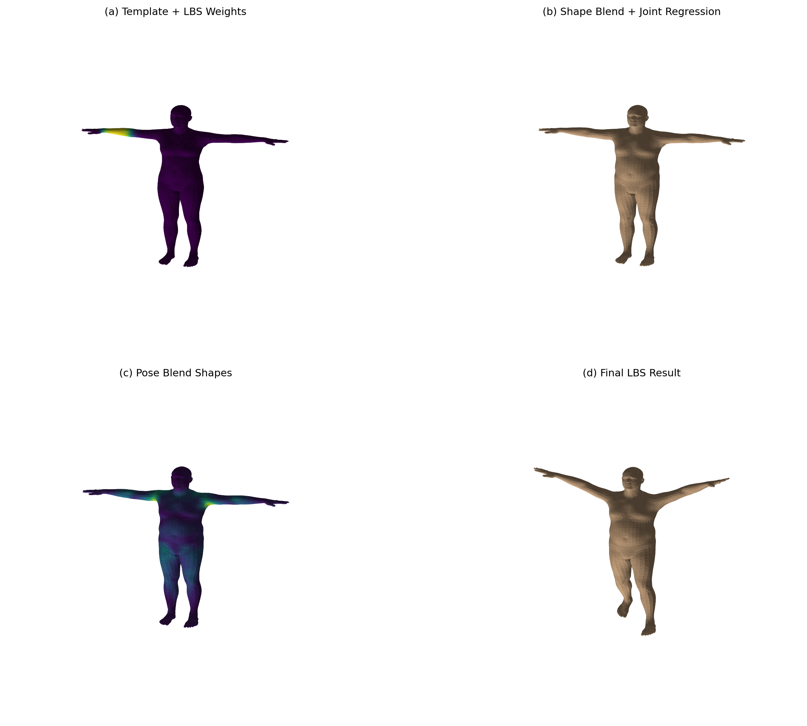
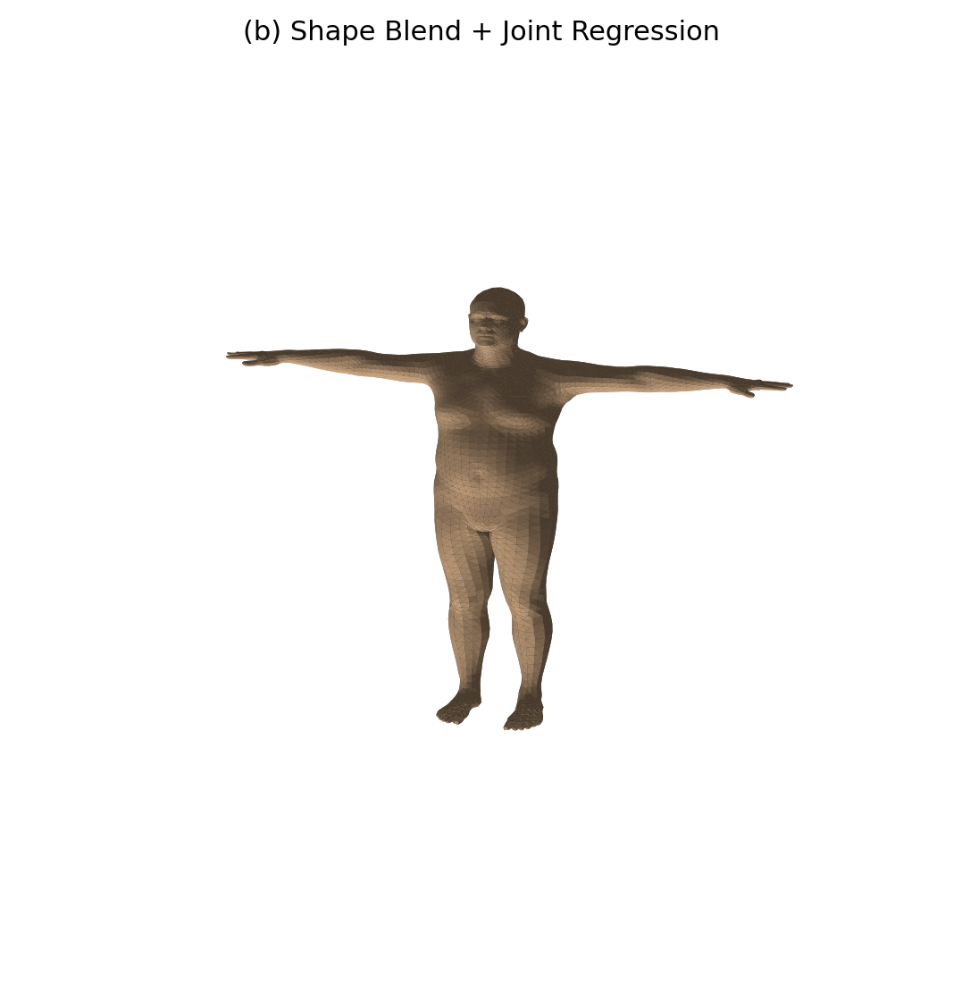
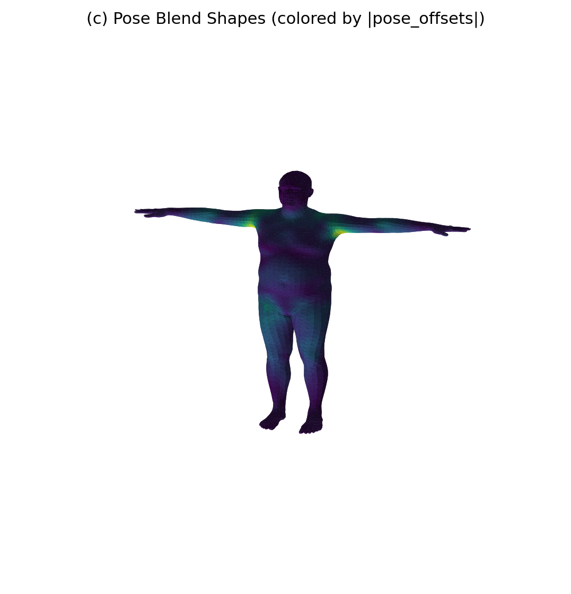
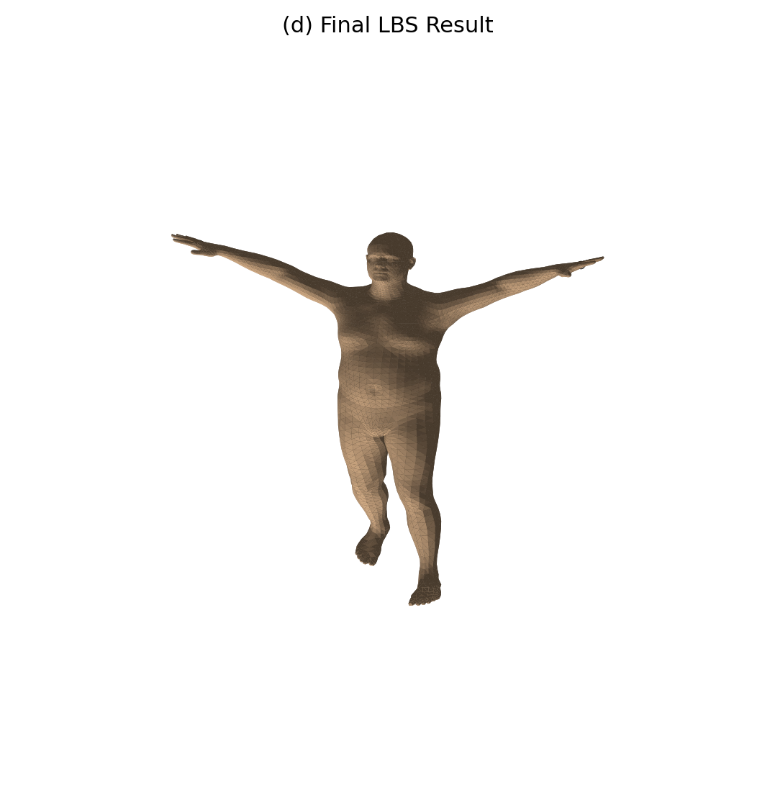
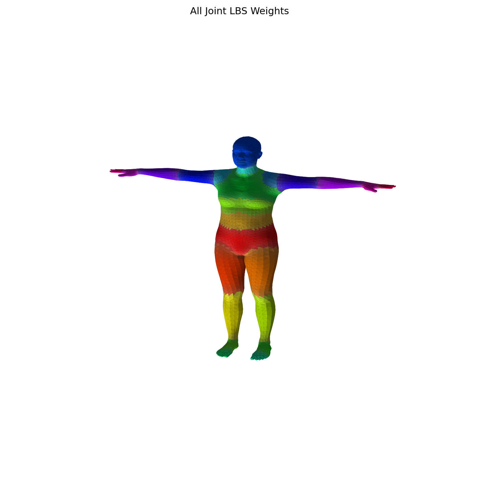

刘玺/202411998366/计算机科学与技术
# 实验8：SMPL人体LBS线性蒙皮算法复现
## 一、运行环境
虚拟环境：`cg-lbs`
依赖包：torch、numpy、matplotlib、smplx、trimesh、scipy
一键安装依赖：
```bash
pip install torch numpy matplotlib smplx trimesh scipy -i https://pypi.tuna.tsinghua.edu.cn/simple
```

## 二、目录说明
```
lab8/
├── run_lbs_lab.py      # 主程序
├── outputs/           # 程序自动生成效果图
└── README.md
```
> ⚠️ SMPL_NEUTRAL.pkl(≈235MB)因体积超限不上传Git，**使用前手动新建models/smpl目录，将模型文件放入：models/smpl/SMPL_NEUTRAL.pkl**。

## 三、运行指令
```bash
# 默认18号关节权重可视化
python run_lbs_lab.py --model-dir ./models --out-dir ./outputs --joint-id 18

# 更换其他关节（范围0~23）
python run_lbs_lab.py --joint-id 5
```

## 四、实验数据
- SMPL顶点总数：6890
- 三角面片数量：13776
- 人体关节数量：24
手写LBS算法与smplx官方实现误差：平均误差=0，最大误差=0，算法实现无误。

## 五、实验效果图







## 六、实验总结
完整复现SMPL标准LBS线性蒙皮四步流程：体型系数形变→关节回归求解→姿态偏移修正→骨骼加权蒙皮；通过与官方库结果对标验证公式正确性，完成单关节、全关节权重可视化渲染。
```

